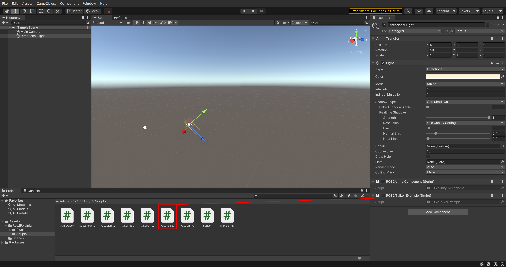

Ros2 For Unity
===============

ROS2 For Unity is a high-performance communication solution to connect Unity3D and ROS2 ecosystem in a ROS2 "native" way. Communication is not bridged as in several other solutions, but instead it uses ROS2 middleware stack (rcl layer and below), which means you can have ROS2 nodes in your simulation.
Advantages of this module include:
- High performance - higher throughput and considerably lower latencies comparing to bridging solutions.
- Your simulation entities are real ROS2 nodes / publishers / subscribers. They will behave correctly with e.g. command line tools such as `ros2 topic`. They will respect QoS settings and can use ROS2 native time.
- The module supplies abstractions and tools to use in your Unity project, including transformations, sensor interface, a clock, spinning loop wrapped in a MonoBehavior, handling initialization and shutdown.
- Supports all standard ROS2 messages
- Custom messages are generated automatically with build, using standard ROS2 way. It is straightforward to generate and use them without having to define `.cs` equivalents by hand.
- The module is wrapped as a Unity asset.

## Platforms

Supported OSes:
- Ubuntu 20.04 (bash)
- Windows 10 (powershell)

Supported ROS2 distributions:
- Foxy
- Galactic

Tested Unity3D version: 2021.1.7f1.

For Windows only, this asset can be prepared in two flavors:
- standalone (no ROS2 installation required on target machine, e.g. your Unity3D simulation server). All required dependencies are installed and can be used e.g. as a complete set of Unity3D plugins.
- overlay (assuming existing (supported) ROS2 installation on target machine). Only asset libraries and generated messages are installed.

## Releases

The best way to start quickly is to use our releases.

You can download pre-built [releases](https://github.com/RobotecAI/ros2-for-unity/releases) of the Asset that support both platforms and specific ros2 and Unity3D versions.

## Building

Note: The project will pull `ros2cs` into the workspace, which also functions independently as it is a more general project aimed at any `C# / .Net` environment.
It has its own README and scripting, but for building the Unity Asset, please use instructions and scripting in this document instead, unless you also wish to run tests or examples for `ros2cs`.

Please see OS-specific instructions:
- [Instructions for Ubuntu 20.04](README-UBUNTU.md)
- [Instructions for Windows 10](README-WINDOWS.md)

## Usage

1. Perform building steps described in the OS-specific readme or download pre-built Unity package.
2. Open or create Unity project.
3. Go to Assets in the menu bar (at the top of the Unity Window).
4. Select `Import Package` → `Custom Package`.
5. In the file browser, select the .unitypackage file built by `create_unity_asset` script (by default located in `install/unity_package`) and follow the instructions on the screen.
6. Create a top-level object containing ROS2UnityComponent.cs. This is the central Monobehavior for ROS2ForUnity that manages all the nodes. Refer to class documentation for details.
7. Add example script to any object in the hierarchy tab, e.g. by dragging `ROS2TalkerExample.cs` to the object in the inspector tab.
8. Select another object in the hierarchy tab and add repeat the previous step using `ROS2ListenerExample.cs`.
9. Once you start the project in Unity, you should be able to see two nodes talking with each other in  Unity Editor's console or use `ros2 node list` and `ros2 topic echo /chatter` to verify ros2 communication.

## Acknowledgements 

Open-source release of ROS2 For Unity was made possible through cooperation with [Tier IV](https://tier4.jp). Thanks to encouragement, support and requirements driven by Tier IV the project was significantly improved in terms of portability, stability, core structure and user-friendliness.
